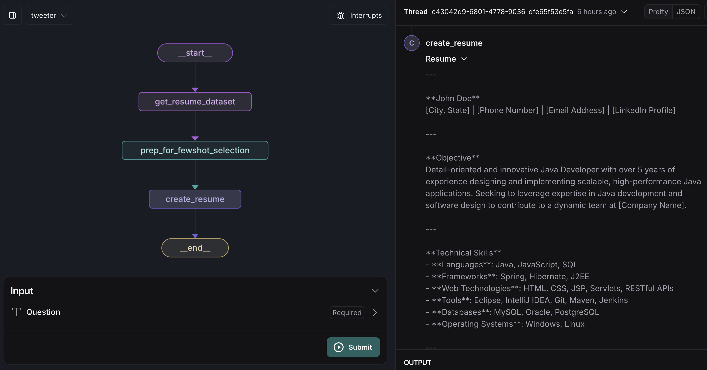
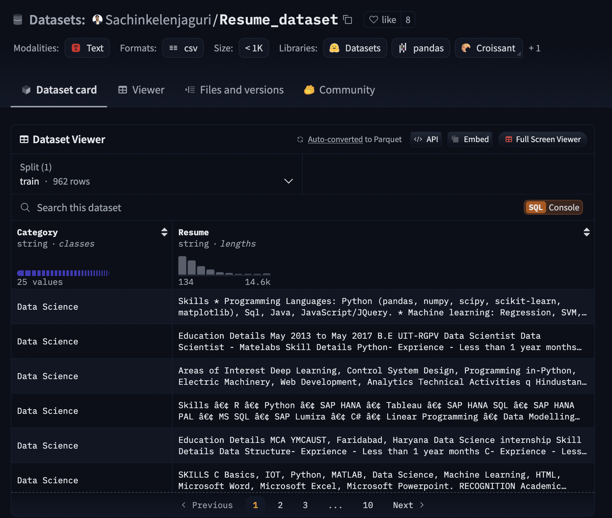

# Resume Creator powered by LangChain :memo: :panda_face:
## An AI agent that creates sample SWE Resume 

An AI Agent that creates sample Software Engineering Resumes using LangChain's LangGraph framework. You can provide years of experience and specified domain (Java developer, Python developer, Front-end engineer) as well to tailor the resume according to the specified domain.

 

 

## Dynamic Few-Shot encoding :trident:

It utilizes the concept of Few Shot encoding. I have used [Resume dataset](https://huggingface.co/datasets/Sachinkelenjaguri/Resume_dataset) from HuggingFace that maintains a list of sample Resumes with their specified domains. The dataset looks somewhat like this.

 

 

I have made the LLM model aware of the above examples so that it can generate similar Resumes for the mentioned domain.